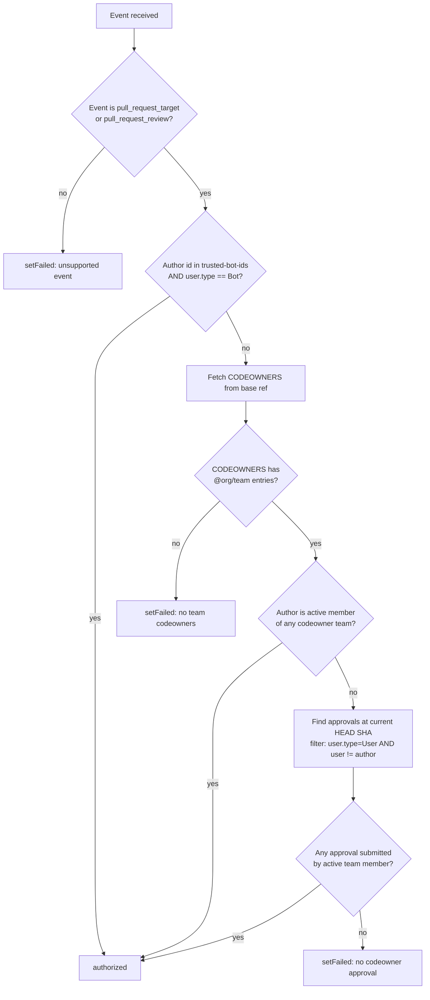

# check-codeowner-auth

Authorizes `pull_request_target` and `pull_request_review` workflow runs by checking whether the PR author or a reviewer is a member of a team listed in the repository's `CODEOWNERS` file.

Designed as a **programmatic substitute** for the manual GitHub `environment: <name>` approval gate on privileged workflows. Same trust decision (a codeowner has authorized this run), enforced automatically.

## Trust boundary

**This action is a security gate. It must be used correctly to be safe. Read this section before adopting.**

The action MUST run in a job that:

1. Is triggered by `pull_request_target` or `pull_request_review`.
2. Contains **no other steps that execute PR-controlled code.** Specifically:
   - No `actions/checkout` (the default checks out the PR head).
   - No `uses: ./<path>` (local actions live in the PR).
   - No `run:` steps that interpolate `${{ github.event.pull_request.* }}` or `${{ github.head_ref }}` into shell commands.
3. Has minimal `permissions:` — the App token is passed via `inputs.github-token`, not via `GITHUB_TOKEN`.

Downstream (privileged) jobs MUST:

1. Declare `needs: authorize` so they only run when the gate passes.
2. Pin `actions/checkout` to `${{ needs.authorize.outputs.head-sha }}`. **Never** use `github.head_ref` (branch name, re-resolves at checkout time) or `refs/pull/<n>/merge` (re-merges live). Failing this rule allows a mid-run force-push to slip untrusted code through the gate.
3. Not receive the App token — it is scoped to the authorize job only.

## Inputs

| Input | Required | Description |
|:--|:--|:--|
| `github-token` | yes | Installation token from a GitHub App with `Members: Read` and `Contents: Read` on the org. Do NOT pass `GITHUB_TOKEN` — it lacks the org-team scope. |
| `trusted-bot-ids` | no | Comma-separated numeric GitHub user IDs (not logins) of bots always authorized as PR authors. Each is verified to have `user.type === 'Bot'` at runtime. |
| `allow-individual-owners` | no | **Temporary** (default `false`). When `true`, individual `@handle` CODEOWNERS entries also authorize, for contexts with no org teams. See [Temporary: running without an org](#temporary-running-without-an-org-allow-individual-owners). Leave `false` in an org. |

## Outputs

| Output | Description |
|:--|:--|
| `head-sha` | The vetted PR head commit SHA. Downstream `actions/checkout` MUST pin to this value. Set on every run with a valid PR payload (both authorized and denied). Absent for the pre-extraction failure modes: `denied_unsupported_event`, `denied_missing_pr`, `denied_malformed_payload`, `denied_config_error`. |
| `outcome` | Machine-readable authorization result, **set on every run**: `authorized_trusted_bot`, `authorized_author`, `authorized_approval`, `denied_unsupported_event`, `denied_missing_pr`, `denied_malformed_payload`, `denied_missing_codeowners`, `denied_no_team_codeowners`, `denied_no_approval`, `denied_api_error`, `denied_config_error` (bad token or unreadable/malformed event, set before the gate runs). |

## Recommended integration: the reusable workflow

**Use the reusable workflow, not the composite action directly.** The
reusable workflow at `friedrichwilken/actions/.github/workflows/authorize.yml`
owns the entire authorize job — token minting, the gate, and token
revocation — so a consumer cannot accidentally add a step (e.g. an
`actions/checkout` of PR head) into the same job as the privileged token.
It also revokes the installation token on exit so a leak is useless within
seconds.

```yaml
on:
  pull_request_target:
    types: [opened, synchronize, reopened]
  pull_request_review:
    types: [submitted]

permissions: {}

jobs:
  authorize:
    uses: friedrichwilken/actions/.github/workflows/authorize.yml@<full-40-char-sha>
    secrets:
      app-private-key: ${{ secrets.AUTH_GATE_PRIVATE_KEY }}
    with:
      app-id: ${{ vars.AUTH_GATE_APP_ID }}
      # trusted-bot-ids: "29139614"   # optional

  privileged-job:
    needs: authorize
    runs-on: ubuntu-latest
    permissions:
      contents: read
    steps:
      - uses: actions/checkout@<full-40-char-sha>
        with:
          ref: ${{ needs.authorize.outputs.head-sha }}   # pin to vetted SHA
      # … privileged work …
```

## Advanced: calling the composite action directly

Only do this if you have a reason the reusable workflow can't serve. When
you call the composite action yourself, **you** are responsible for the
trust-boundary rules in the section above — most importantly, the
`authorize` job MUST NOT contain any step that runs PR-controlled code, and
you should revoke the minted token on exit yourself.

```yaml
on:
  pull_request_target:
    types: [opened, synchronize, reopened]
  pull_request_review:
    types: [submitted]

permissions: {}

jobs:
  authorize:
    runs-on: ubuntu-latest
    permissions:
      contents: read
    outputs:
      head-sha: ${{ steps.gate.outputs.head-sha }}
    steps:
      - uses: actions/create-github-app-token@<full-40-char-sha>  # pin to SHA
        id: app-token
        with:
          app-id: ${{ vars.AUTH_GATE_APP_ID }}
          private-key: ${{ secrets.AUTH_GATE_PRIVATE_KEY }}
          owner: ${{ github.repository_owner }}
      - uses: friedrichwilken/actions/.github/actions/check-codeowner-auth@<full-40-char-sha>
        id: gate
        with:
          github-token: ${{ steps.app-token.outputs.token }}

  privileged-job:
    needs: authorize
    runs-on: ubuntu-latest
    permissions:
      contents: read
    steps:
      - uses: actions/checkout@<full-40-char-sha>
        with:
          ref: ${{ needs.authorize.outputs.head-sha }}   # pin to vetted SHA
      # … privileged work …
```

## CODEOWNERS requirements

- Only `@<org>/<team>` entries are counted. Individual GitHub handles (e.g. `@someuser`) are ignored with a warning.
- Only teams in the **same org** as the repository are counted. `@other-org/team` entries are ignored.
- Repositories that use individual-handle CODEOWNERS must migrate to teams before adopting this gate.
- The file is read from the **base ref** via the GitHub REST contents API, not the runner filesystem. A PR that modifies CODEOWNERS in its head branch does not affect the gate's decision.
- Missing / empty / team-less CODEOWNERS files cause the action to fail closed.

### Temporary: running without an org (`allow-individual-owners`)

> **This is a temporary bridge and will be removed.** The permanent model is
> teams-only (the section above). Leave `allow-individual-owners` unset/`false`
> in any organization.

The team-membership check uses the GitHub teams API, which only exists for
**organizations**. To run the action somewhere that has no teams — e.g. a
personal account, before the repo moves to its org home — set
`allow-individual-owners: true`. Individual `@handle` CODEOWNERS entries then
also authorize:

- the PR **author** if their login matches a listed `@handle`, or
- an **approver** whose login matches a listed `@handle` (the approval still
  has to pass every normal filter: not a bot, not the author, submitted on the
  current HEAD SHA).

This path does no extra API call — it's a direct login match against the same
**base-ref** CODEOWNERS, so a PR still cannot self-authorize by adding its own
handle in the PR head. When the action moves to an org with real teams, drop
this input and go back to teams-only.

## Authorization logic



## Design notes

Documented for reviewers and future maintainers. If you're changing this action, read these first.

### Why base-ref CODEOWNERS, not workspace

On `pull_request_target`, a naive `actions/checkout` writes the PR-HEAD version of the repo to the workspace. Reading `CODEOWNERS` from disk would then read the attacker's version. The action fetches from the base ref via the contents API so this is not possible.

### Why `state === 'active'` on team membership

`GET /orgs/{org}/teams/{team}/memberships/{user}` returns 200 with `state: 'pending'` for outstanding invitations that the user has not accepted. Treating "didn't 404" as "is a member" would authorize attackers who have been sent an invite but never accepted it. The action requires `state === 'active'`.

### Why numeric bot IDs, not logins

GitHub usernames can be recreated after deletion. A trusted-bot allowlist keyed by login would break the moment `renovate[bot]` is deleted and re-registered. Numeric user IDs are stable. The allowlist also requires `user.type === 'Bot'` as defense-in-depth.

### Trusted bots skip CODEOWNERS entirely — the trade-off

A PR whose author matches a `trusted-bot-ids` entry (and is `user.type === 'Bot'`) is authorized **before any CODEOWNERS fetch or approval check** — it gets whole-run authorization with no codeowner involvement. This is deliberate (it's how dependency-update bots like Renovate open PRs that must run privileged jobs without a human approving each one), but be clear-eyed about the blast radius: **a compromised trusted-bot credential is a full `pull_request_target` bypass** for every consumer that lists that bot. `user.type` is set by GitHub and not attacker-forgeable, so an ordinary user cannot impersonate a bot — but the bot's own token/app is now part of your trust boundary. Only add a bot to `trusted-bot-ids` if you would equally trust it to approve arbitrary code, and prefer scoping which repos install the bot.

### Why the approver-not-author check

GitHub server-side blocks a PR author from approving their own PR with 422. Defense-in-depth: the action also filters `review.user.login !== pr.user.login` in case that server-side check is ever bypassed by a race or edge case.

### Why the approver-must-be-User check

If a bot account is ever added to a codeowner team (e.g. an "auto-approve trivial docs" bot), an attacker can craft a PR that trips the bot's heuristics and gets an approval. Rejecting `user.type === 'Bot'` on the approver side prevents this. Trusted bots are handled explicitly via the `trusted-bot-ids` input, not via team membership.

### Nested team semantics

`GET /orgs/{org}/teams/{team}/memberships/{user}` recurses into child teams. If someone nests a broader team under a codeowner team, its members transitively become codeowners. This is documented as intentional — nested teams are legitimate GitHub org structure. Maintainers of the codeowner teams should be aware.

### Codeowner scoping is global, not path-scoped

If any codeowner team owns any path in the repo, its members can authorize the whole run. This matches env-gate semantics (a human clicking "Approve" on the environment gate authorizes the whole run, not per-path). Path-scoped authorization is a future enhancement — it would require parsing which paths the PR touches and matching CODEOWNERS patterns.

## Required GitHub App permissions

- `Organization → Members: Read` — for team membership lookups.
- `Repository → Contents: Read` — for fetching CODEOWNERS from the base ref.

Install the App on a **Selected repositories** list, not org-wide. Rotate the private key on a schedule.

## Known limitations

- **No mid-run re-check.** Once a downstream job starts, it runs to completion regardless of subsequent approval dismissals. Same limitation as the manual env-gate.
- **No script-injection protection.** If a consumer workflow interpolates PR-controlled fields into `run:` blocks, the auth-gate cannot help. Workflow-file discipline is a separate concern.
- **No cross-org codeowner support.** `@other-org/team` entries in CODEOWNERS are ignored. The action only checks teams within the same org as the repository.
- **The reusable workflow's inner action pin is bumped manually.** `authorize.yml` pins the composite action by commit SHA. Dependabot cannot bump a repository's reference to itself, so when the action changes, that pin must be updated in the same PR (a stale pin means consumers keep running the old gate code). Once versioned release tags exist, the pin can move to a release SHA.
